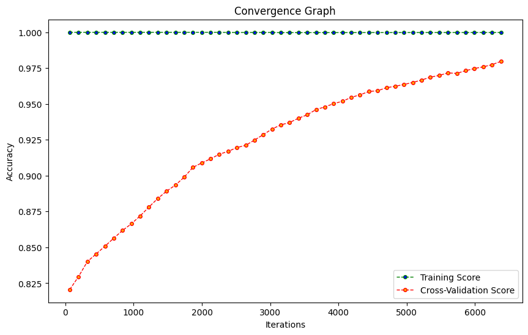

# Parameter Optimization of SVM
Assignment for UCS654

## About SVM and Parameter Optimization

Support Vector Machine or SVM is one of the most popular Supervised Learning algorithms, which is used for Classification as well as Regression problems. However, primarily, it is used for Classification problems in Machine Learning.

Some of the most important parameters of SVM such as kernel, C, and gamma can be changed in order to achieve a higher accuracy. This is called as Hyperparameter Tuning. 

We can perform this task using GridSearchCV for optimizing these parameters.

In this python file, I've used a Fitness Function to optimize the parameters.

## Dataset

The dataset for the project has been downloaded from the UCI Machine Learning Repository.
[https://archive.ics.uci.edu/ml/datasets/Room+Occupancy+Estimation](https://archive.ics.uci.edu/ml/datasets/Room+Occupancy+Estimation)

This dataset is used for estimating the precise number of occupants in a room using multiple non-intrusive environmental sensors like temperature, light, sound, CO2 and PIR. It is a multi-variate classification Dataset.

Number of Instances: 10129

Number of Attributes: 16

## Final Result Table

|index|Sample|Best Accuracy|Best Kernel|Best Nu|Best Epsilon|
|---|---|---|---|---|---|
|0|1|0.91|poly|4.5|9.57|
|1|2|0.98|rbf|9.89|0.08|
|2|3|0.96|poly|5.33|1.46|
|3|4|0.9|linear|9.24|1.93|
|4|5|0.96|poly|6.86|0.4|
|5|6|0.84|poly|8.83|8.33|
|6|7|0.94|linear|3.14|1.89|
|7|8|0.96|linear|5.08|2.15|
|8|9|0.88|linear|3.84|0.7|
|9|10|0.89|linear|9.09|1.61|

## Convergence Graph

## Discussion
From the above graph, we can conclude that the model is well trained and parameter have been optimized due to the less gap between training and cross-validation curve.

The graph is made for the sample which has best accuracy. Sample 9 has the best accuracy of 0.98 having kernel = rbf, Nu = 9.89 and Epsilon = 0.08.

## Written By
Name : Pulkit
  
Roll No. : 102003619

Sub-Group: 3COE24
